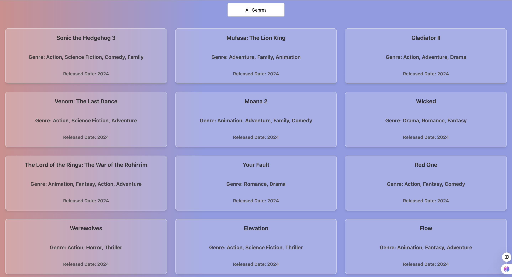
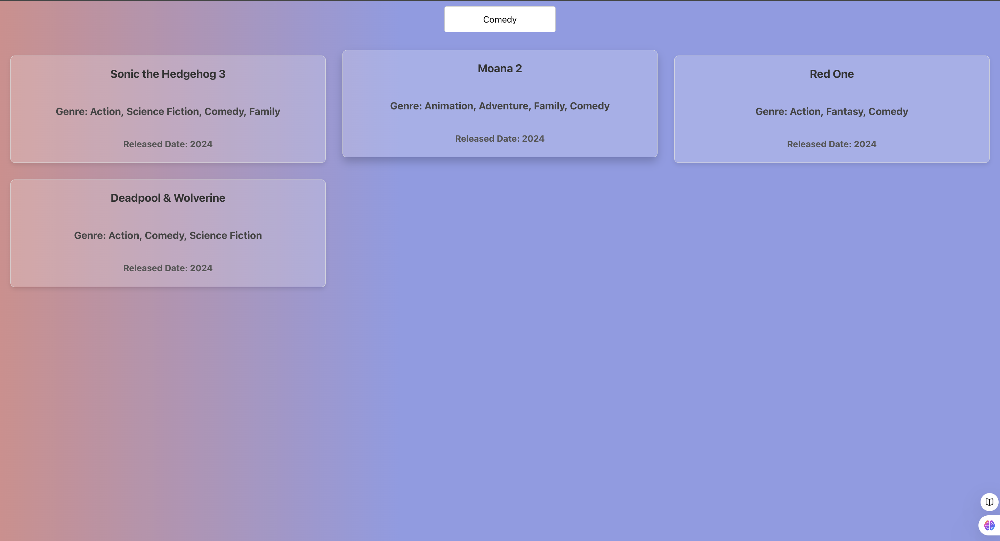
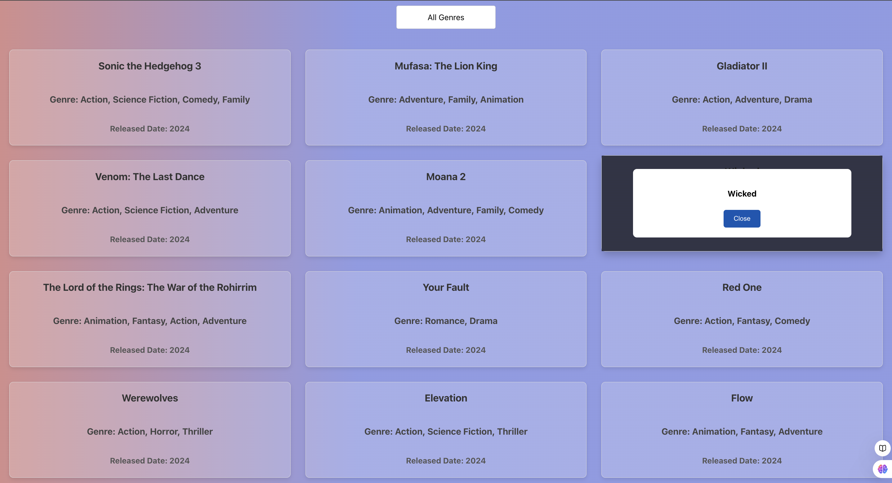

# Movie List

## Input
The program accepts a predefined array of movie objects, each containing properties such as title, genre, and release year. It also allows user interaction through a dropdown for genre selection and a click event on individual movie items.

## Process
The program initializes with a list of movies and renders them using React components. It processes user input by filtering the movie list based on the selected genre from the dropdown. Upon clicking a movie item, it triggers an alert displaying the movie's title. State management and React hooks are utilized to handle the dynamic updates and interactivity.

## Output
The output is a dynamically updated list of movie cards displayed in the UI. The list changes based on user-selected filters, and an alert shows the selected movie's title when clicked. The program ensures a responsive user experience by re-rendering the movie list in real-time according to user interactions.

## Run React.js Frontend Server
* Open New Terminal
* cd client
* npm install
* npm start

## Author
- Name: Ayush Kumar Gupta
- Email: guptaayushkumar@cityuniversity.edu

