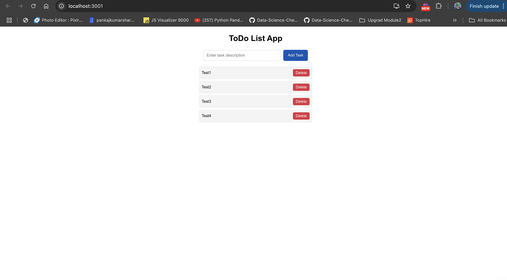

# ToDo List App

## Input
The program accepts user input through an input field where users can enter a ToDo description. Users can add tasks by clicking the "Add Task" button and remove tasks using the "Delete" button next to each ToDo item.

## Process
The application initializes with an empty ToDo list and dynamically updates based on user interactions. The useState hook is used for state management, storing the list of ToDos. When a user adds a task, it is appended to the list and displayed. The .map() function is used to render the ToDo items dynamically. Each task has a "Delete" button that allows users to remove it from the list. Event handlers capture user interactions to update the UI accordingly.

## Output
The output is a dynamically updated list of ToDo items displayed in the UI. Users can see their tasks added in real-time, and they can remove tasks as needed. The app ensures a smooth user experience by re-rendering the list dynamically.

## Run React.js Frontend Server
* Open New Terminal
* cd client
* npm install
* npm start

## Author
- Name: Ayush Kumar Gupta
- Email: guptaayushkumar@cityuniversity.edu

