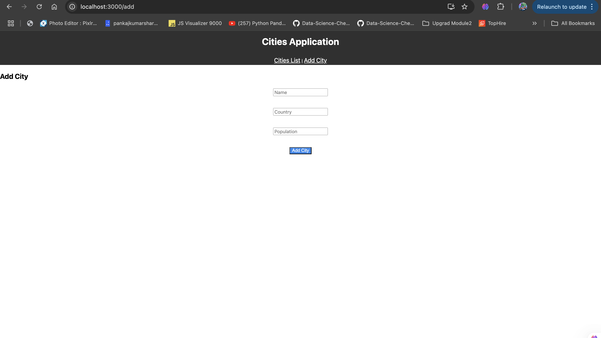
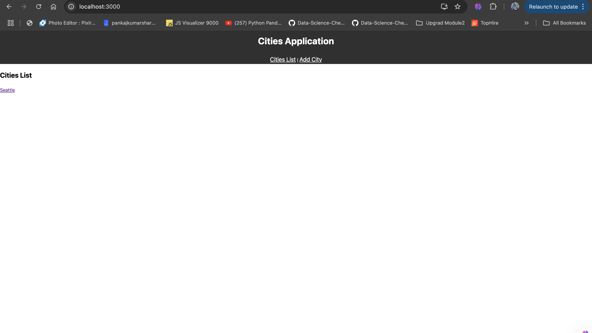
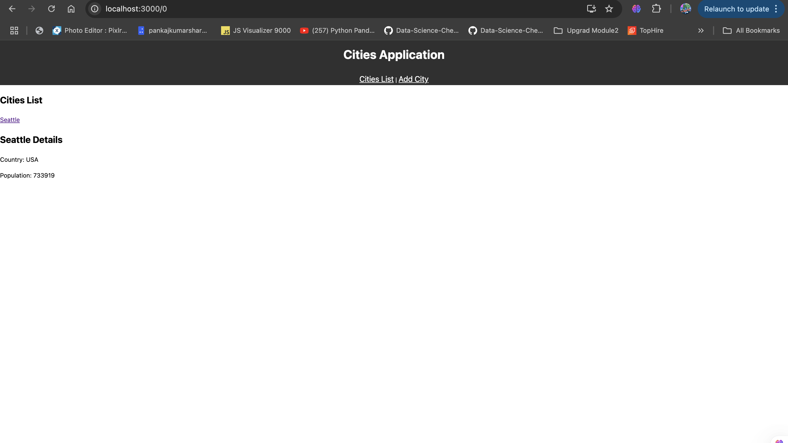

# City List App

## Input
The program accepts user input through a React-based web application that allows users to interact with city information. Users can:

- View a list of cities.
- Add new city details, including name, country, population, and other relevant data.
- Click on a city from the list to view its detailed information.

## Process
The application processes user input by utilizing React Router for navigation. When a user submits city details, the data is captured and stored within the application state. The useParams hook retrieves city-specific data for display when navigating to the city details page. Additionally, the application implements redirection functionality to improve user experience, such as redirecting to the city list after adding a new city.

## Output
The output consists of dynamically rendered components:

- A list of cities with clickable links.
- A form to add a city.
- A detailed view of a selected city displayed within the existing layout, ensuring seamless navigation and user experience.

## Run React.js Frontend Server
* Open New Terminal
* cd client
* npm install
* npm start

## Author
- Name: Ayush Kumar Gupta
- Email: guptaayushkumar@cityuniversity.edu

