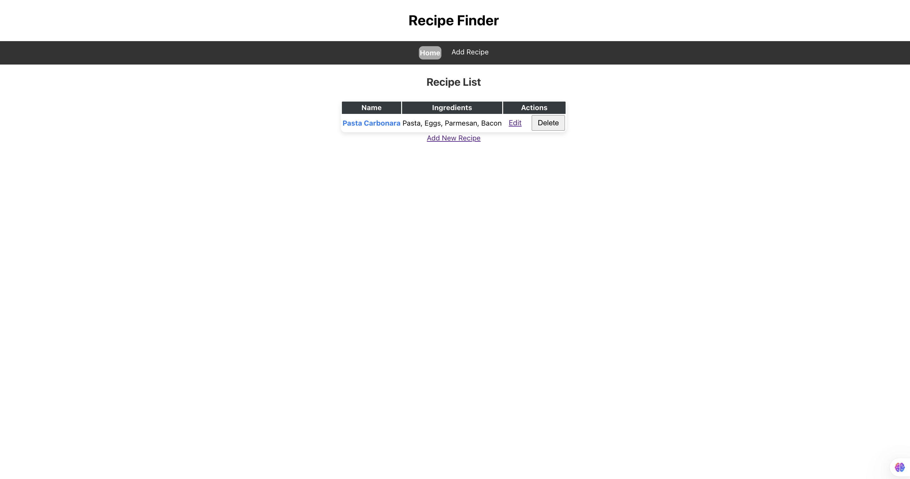
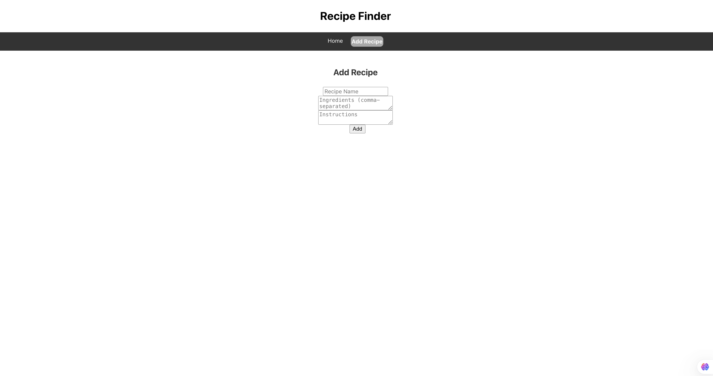
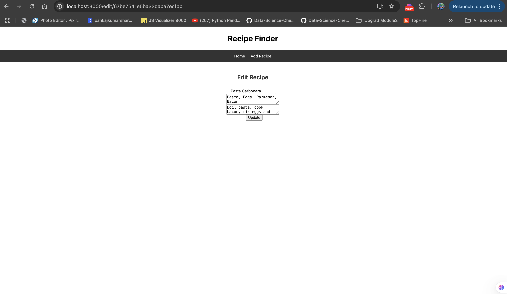
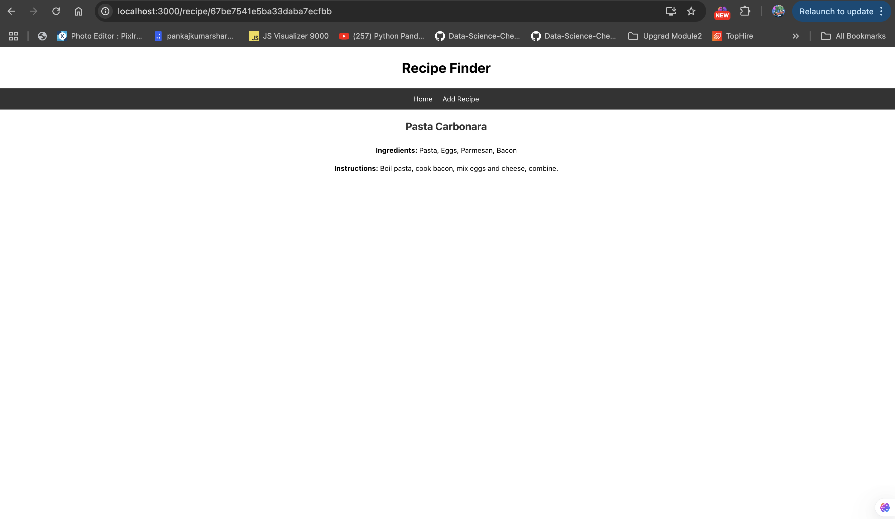

# Recipe Finder App

## Input
The Recipe Finder application accepts user inputs through a web interface. Users can:
- Add a recipe by entering a name, ingredients (comma-separated), and cooking instructions.
- Update an existing recipe by modifying its details.
- Delete a recipe from the system.
- View a list of all recipes and click on any recipe to see its details.

## Process
- The frontend, built with React, captures user inputs and sends requests to the backend via Axios.
- The backend, built using Node.js and Express, processes requests and interacts with MongoDB Atlas for data storage.
- CRUD operations (Create, Read, Update, Delete) are performed via REST API endpoints.

## Output
- The application displays a styled table of recipes.
- Clicking a recipe shows detailed information.
- Users can modify or remove recipes dynamically.
- Changes are reflected in real-time in the database and UI.

## Run React.js Frontend Server
* Open New Terminal
* cd frontend/recipe-finder
* npm install
* npm start

## Run Node + Express + MongoDB Backend Server
* cd backend
* Update .env file
* npm install
* node server.js

## Author
- Name: Ayush Kumar Gupta
- Email: guptaayushkumar@cityuniversity.edu

