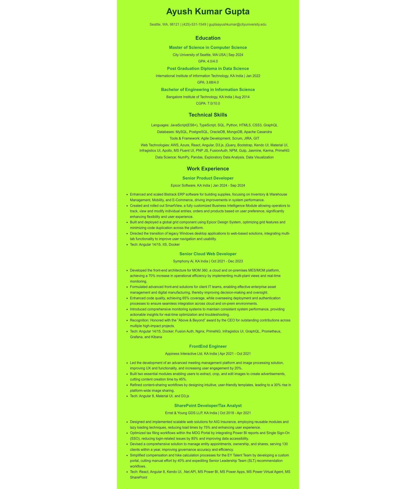

# MyResume

### Problem
Create a “MyResume” web app that will display your Resume using react. The resume includes the name and contact information of the person, their education, skills, work experience, and projects.

###	User Requirements
*	The background color of the resume page should be rgba(#bdfb04)
*	All the text should be defaulting color black.
*	Adjust the margins and fonts to match the sample image shown below.
###	System Requirements
*	You need to develop Resume.js (Resume Component) and Resume.css
*	Import these two files to your App.js

## Input
The user interacts with the "MyResume" web app by providing their personal information, including name, contact details, education, skills, work experience, and project details. This data is either hardcoded within the source files or fetched from an external source. 

## Process
- The application, built using React and set up via Create React App, processes the input data by rendering it through the Resume.js component. This component structures the data into various sections, styled using Resume.css. The React framework manages the virtual DOM, ensuring efficient updates and rendering.

## Output
- The final output is a styled, responsive resume displayed in the user's browser. The app presents the resume data with a background color of rgba(#bdfb04) and default black text. The layout and font styles are tailored to provide a clean and professional presentation of the user's resume, with specific design adjustments to match given requirements.

### Run React.js Frontend Server
* Open New Terminal
* cd client
* npm install
* npm start

### Author
- Name: Ayush Kumar Gupta
- Email: guptaayushkumar@cityuniversity.edu

